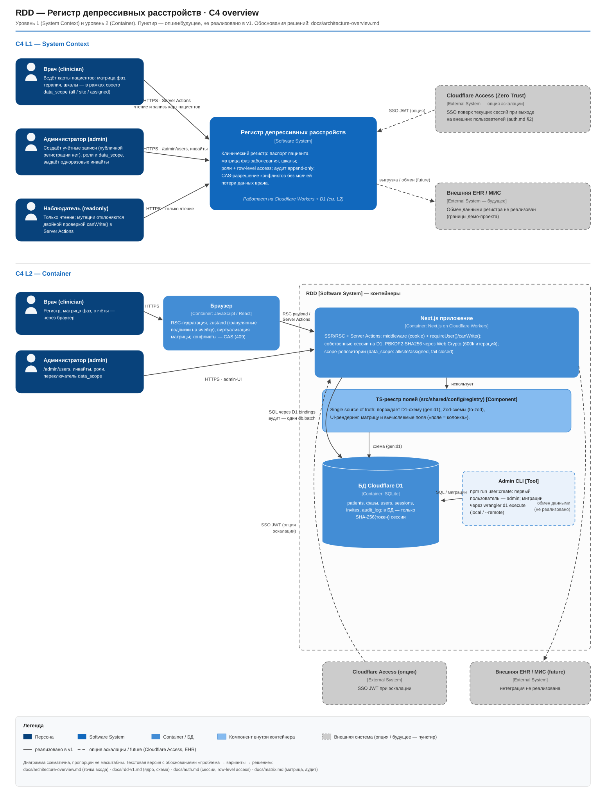

# Architecture Overview — точка входа в документацию RDD

**Назначение:** выжимка архитектурных решений для быстрого знакомства (3–5 минут).
Это не пересказ спецификаций: каждый раздел — самая показательная развилка «проблема → рассмотренные варианты → решение» со ссылкой на первоисточник, где лежит полный разбор с порогами эскалации.

> **Как читать документацию.** Этот файл — входная точка. Рабочий слой — детальные
> спецификации: [rdd-v1.md](./rdd-v1.md) (ядро, реестр, схема данных), [auth.md](./auth.md),
> [matrix.md](./matrix.md), [roadmap.md](./roadmap.md) и спеки этапов `spec-stage-1..4.md`.
> Количественные характеристики системы (Availability, RTO/RPO, пороги производительности)
> сведены в [nfr.md](./nfr.md).
> Они сохранены в форме decision-trail (таблицы «проблема → альтернативы → решение»,
> зачёркнутые пункты по мере закрытия TODO) намеренно — это фиксация хода мышления,
> а не только итогового состояния.

---

## C4-обзор: System Context и Container (одна картинка)

Быстрый уровень для ревьюера: кто взаимодействует с системой и из чего она состоит.
Текстовая версия с обоснованиями «проблема → варианты → решение» — разделы ниже.

- **L1 System Context:** врач (`clinician`), admin, `readonly` → RDD; пунктиром —
  Cloudflare Access (опция эскалации, [auth.md §2](./auth.md)) и будущая EHR (не реализована,
  см. «Границы демо-проекта»).
- **L2 Container:** браузер → Next.js на Cloudflare Workers (Server Actions, `requireUser()`,
  PBKDF2, scope-репозитории) → D1; TS-реестр полей как component, порождающий схему/Zod/UI;
  Admin CLI для `user:create` (публичной регистрации нет).
- Пунктирные стрелки = опция/будущее; сплошные = реализовано в v1.

---

## 1. Registry-driven core — одна схема на всё

**Проблема:** медицинский регистр с ~50+ полями: как избежать рассинхрона между схемой БД,
валидацией, UI и вычислениями, который обычно убивает такие проекты.

**Рассмотренные варианты:** раздельные описания на каждом слое (типичный подход) против
единого декларируемого источника правды.

**Решение:** единый TS-реестр (`src/shared/config/registry/`) порождает всё: схему D1
(через diff-генератор `gen:d1`), Zod-схемы (`to-zod.ts`), UI-рендеринг, матрицу и
вычисляемые поля. «Поле = колонка» — инвариант, на котором построены все слои.

**Порог эскалации:** зафиксирован явно (см. rdd-v1.md §3, §7.5).

→ Подробно: [rdd-v1.md §3](./rdd-v1.md)

## 2. Хранение бинарных клинических признаков

**Проблема:** десятки бинарных диагностических флагов (симптомы, терапия, ремиссия) —
плоские колонки, EAV, битовая маска или JSON?

**Рассмотрены 5 вариантов** (плоские колонки / EAV / битмаска / JSON-колонка / гибрид).
JSON отклонён намеренно, несмотря на доступность JSON1 в D1: он выключает поля из цепочки
«реестр → схема → Zod → UI» и усложняет статистические агрегаты по отдельному признаку.

**Решение:** плоские колонки `INTEGER 0/1` — агрегаты одним `WHERE col = 1`, полная
типизация, авто-миграция из реестра. На масштабе ~50 флагов альтернативы не дают выигрыша.

**Порог эскалации:** >100–150 флагов, появление атрибутов у признака, динамические поля
→ миграция к гибриду.

→ Подробно: [rdd-v1.md §7](./rdd-v1.md)

## 3. CAS и разрешение конфликтов — клинический инвариант

**Проблема:** два врача редактируют одну фазу параллельно. Наивный optimistic locking
просто отклонит второй патч — молча потеряв работу врача.

**Решение:**

- CAS по `updated_at` из SQLite (`strftime`), не из клиентских часов — клиенту не доверяем время;
- разрешение конфликта на трёх уровнях: ячейка / фаза / авто-мерж непересекающихся ячеек;
- явное противоборство «моё / чужое» в UI с обязательным аудитом каждого разрешения.

**Инвариант:** данные врача не теряются молча ни в одном сценарии — перед любой
автозаменой значение доступно в диффе и аудите. Это не «просто optimistic locking»,
а требование клинической безопасности данных.

→ Подробно: [matrix.md §6](./matrix.md), [spec-stage-1.md §4](./spec-stage-1.md)

## 4. Аутентификация под Edge-ограничения

**Проблема:** Cloudflare Workers не имеют `node:crypto` — bcrypt/argon2 недоступны нативно.

**Рассмотренные варианты:** Auth.js/Lucia (лишняя зависимость без OAuth-сценария),
Cloudflare Access (завязка на CF-аккаунт), публичная регистрация (запрещена — PII).

**Решение:** собственные сессии на D1 + **PBKDF2-SHA256 через Web Crypto**
(200k итераций, параметры внутри строки хэша). Токен сессии живёт только в HttpOnly
cookie, в БД — SHA-256(токен): утечка базы не угоняет сессии. Двухуровневая защита
маршрутов: middleware по наличию cookie (быстро) + `requireUser()` с валидацией в БД
(строго).

→ Подробно: [auth.md §2, §4, §5, §7](./auth.md)

## 5. Аудит как обязательное требование, а не опция

Для клинического регистра аудит — требование предметной области, а не фича.
`audit_log` — append-only, вне реестра; запись данных и аудит-событие — один `db.batch`
(атомарность); PII в лог не дублируется (только id); каждое разрешение конфликта
фиксируется со значениями «до/после» и затёртой версией.

→ Подробно: [matrix.md §6.6](./matrix.md), [auth.md §11](./auth.md)

## 6. Row-level access: аутентификация ≠ авторизация на уровне данных

**Проблема:** роль `clinician` по умолчанию видит всех пациентов. В реальном
многоцентровом исследовании врач видит только пациентов своего центра/своих
назначенных — причём фильтр по прямой ссылке на карту должен работать так же,
как по списку (иначе IDOR).

**Рассмотренные варианты:** фильтр, зашитый в роль (жёстко); только site-level
(просто, но теряется «назначенный врач»); many-to-many `patient_access`
(максимальная гибкость, избыточно для демо).

**Решение:** декларативный `data_scope` на пользователе (`all` / `site` /
`assigned`) + `site_id`/`assigned_clinician_id` на пациенте. Репозиторий
создаётся уже ограниченным: `createPatientRepository(db, patientScopeFor(user))` —
все выборки, включая `findById`, уважают scope. Fail closed: `site` без
привязки к центру не видит ничего. Переключатель — у admin в `/admin/users`.

→ Подробно: [auth.md — Row-level access](./auth.md)

## 7. Матрица: sticky + виртуализация без scroll-синхронизации

**Проблема:** фиксированная левая колонка + фиксированная шапка + виртуализация сотен строк.

**Решение:** каждая виртуализированная строка — CSS Grid, левая ячейка `position: sticky`
внутри строки. Это избегает классической ловушки двух независимых слоёв с ручной
синхронизацией scrollLeft/scrollTop. Состояние — zustand с гранулярными подписками
на ячейку (ре-рендерится только изменённая ячейка); `react-hook-form` для грида
намеренно не используется.

## Security-сводка: угроза → мера → где реализовано

| Угроза                                    | Мера                                                                                            | Где                                                     |
| ----------------------------------------- | ----------------------------------------------------------------------------------------------- | ------------------------------------------------------- |
| Подбор паролей (brute force)              | Rate-limit: 5 неверных паролей → блокировка 15 мин                                              | [spec-stage-3](./spec-stage-3.md), README               |
| Перебор логинов (enumeration)             | Одинаковая задержка ответа 400 мс для существующих/несуществующих email                         | [auth.md §6](./auth.md)                                 |
| Утечка БД → угон сессий                   | В БД только SHA-256(токен); токен живёт только в HttpOnly cookie                                | [auth.md §5](./auth.md)                                 |
| Слабый хэш пароля                         | PBKDF2-SHA256, 200k итераций, constant-time сравнение, параметры в строке хэша                  | [auth.md §4](./auth.md)                                 |
| Перехват cookie                           | `Secure; HttpOnly; SameSite=Lax`, TTL 12 ч, sliding renewal                                     | [auth.md §5](./auth.md)                                 |
| Мутация мимо UI (readonly-роль)           | Двойная проверка: UI `isReadOnly` + `canWrite()` в каждом Server Action                         | [spec-stage-1.md §1, §3](./spec-stage-1.md)             |
| Clinician видит чужих пациентов (IDOR)    | `data_scope` на пользователе; scope-репозиторий фильтрует `list/listPage/count/findById`        | [auth.md — Row-level access](./auth.md)                 |
| Инъекция полей клиентом                   | Whitelist `DATA_COLUMNS`, Zod `phaseSchema.partial()`, системные поля не принимаются от клиента | [spec-stage-1.md §2](./spec-stage-1.md)                 |
| Потеря авторства изменений                | `actor_id` из `requireUser()` в каждой мутации, аудит в одном `db.batch` с записью              | [auth.md §11](./auth.md), [matrix.md §6.6](./matrix.md) |
| Утечка PII через логи                     | В `audit_log` только id и JSON значений, без дублирования персональных данных                   | [matrix.md §6.6](./matrix.md)                           |
| Передача прав через публичную регистрацию | Регистрация запрещена; учётки создаёт только admin; инвайты — одноразовые ссылки с TTL 7 дней   | [auth.md §1–2, §9](./auth.md)                           |

---

## Границы демо-проекта: что не реализовано намеренно

Проект — демонстрация архитектурных навыков, а не продакшен для реальных пациентов.
Следующие требования реального клинического продакшена **сознательно вынесены за рамки**;
их выполнение потребовало бы отдельного контура работ:

- **Регуляторика и комплаенс.** HIPAA / 152-ФЗ / GDPR-подобные требования, соглашения
  с пациентами, DPA с обработчиками — не реализованы и не имитируются. Демо-данные —
  синтетические, реальных персональных данных в системе нет и быть не должно.
- **Шифрование at rest и разделение окружений.** D1 шифруется средствами платформы;
  отдельный контур с key management (BYOK/KMS), разделением демо- и реальных данных,
  изоляцией окружений — не развёрнут.
- **Backup / DR.** Для D1 настроены только ручные миграции; регулярные бэкапы,
  point-in-time recovery, план восстановления — вне scope демо.
- **Retention и удаление данных.** Политики хранения, право на забвение, процедурное
  удаление пациента (включая каскад по `audit_log`, который append-only) не реализованы —
  это отдельное архитектурное решение (криптографическое стирание или анонимизация аудита).
- **Медицинская валидация.** Вычисляемые поля (чистая ремиссия, возраст) — упрощённые
  демонстрационные правила; валидация клинических шкал и логики врачом-экспертом не проводилась.
- **Масштабирование коллаборации.** Обновления между пользователями — polling 30–60 с
  вместо WebSocket/SSE (осознанный компромисс v1). Порог эскалации на push-обновления —
  при систематической параллельной работе врачей над одним пациентом (см. [matrix.md §6](./matrix.md)).
- **Обязательность полей.** Zod-схема генерирует все поля `optional().nullable()`
  (нужна для partial-патчей); серверная проверка required-логики отсутствует и
  компенсируется UI — при переводе в прод это необходимо закрыть на уровне схемы.

Каждый пункт — не «забыли», а «понимаем и вынесли за рамку». Пороги эскалации по
актуальным из них (rate-limit, password-флоу, push-обновления) зафиксированы в
соответствующих спеках.
